# Testing

This section outlines the testing process carried out during the development of the Freelancer Budget Tracker application.

Testing was conducted to ensure that all features function correctly, the user experience remains consistent across devices, and the application meets expected performance, accessibility, responsiveness, and security standards.

---

## Code Validation

The application was validated using industry-standard tools to ensure clean, accessible, and standards-compliant code.

Validation was performed on both frontend and backend components to ensure compliance with web standards and best practices.

Return back to the [README.md](README.md) file.

| Page | Screenshot | Result |
|------|------------|--------|
| Login Page |  | Pass: No Errors |
| Dashboard |  | Pass: No Errors |
| Transactions |  | Pass: No Errors |
| Categories | 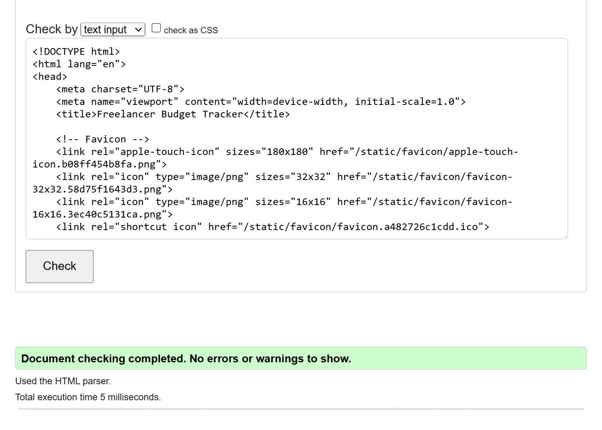 | Pass: No Errors (Minor warning resolved) |
| Edit Transaction |  | Pass: No Errors |
| Edit Category |  | Pass: No Errors |
| Premium | 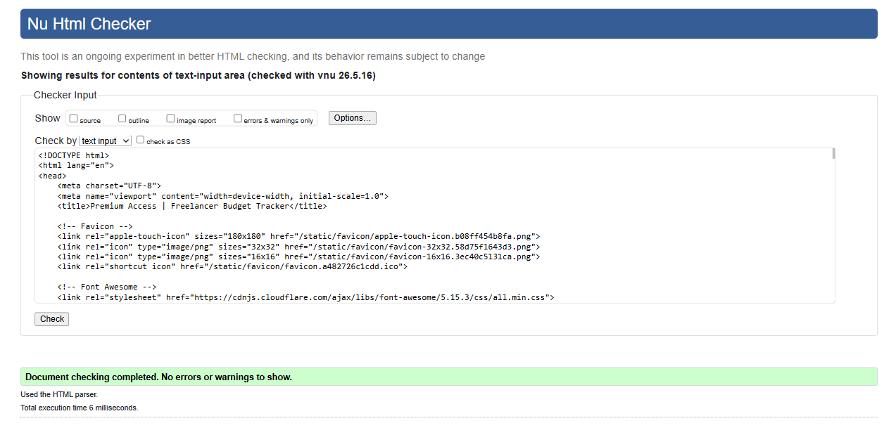 | Pass: No Errors |
| Home | 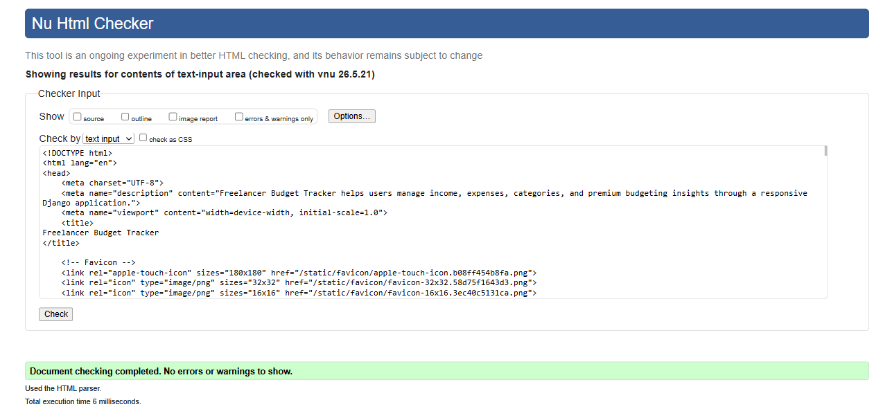 | Pass: No Errors |

All pages passed validation successfully, confirming that the HTML code adheres to W3C standards and is free of critical errors.

Minor warnings identified during development were resolved to improve code quality, semantic structure, accessibility, and maintainability.

All validation screenshots were stored within the `test_images` folder for assessment evidence.

---

## CSS Validation

The CSS was validated using the [W3C Jigsaw Validator](https://jigsaw.w3.org/css-validator).

| File | Screenshot | Result |
|------|------------|--------|
| style.css |  | Pass: No Errors |

Autoprefixer was implemented to improve cross-browser CSS compatibility, ensuring that the application functions correctly across different browsers and browser versions.

---

## Python Validation

Python code was validated using the [PEP8 CI Python Linter](https://pep8ci.herokuapp.com/).

All tested Python files passed validation successfully without errors, confirming adherence to Python best practices and PEP8 standards.

| File | Screenshot | Result |
|------|------------|--------|
| models.py |  | Pass |
| views.py |  | Pass |
| urls.py |  | Pass |
| forms.py |  | Pass |

---

## Manual Testing

Manual testing was conducted to verify all core application functionality.

| Feature | Expected Behaviour | Testing Performed | Result |
|--------|------------------|------------------|--------|
| User Login | Users can log in with valid credentials | Tested valid and invalid login attempts | Pass |
| User Logout | Users can securely log out | Clicked logout and verified session ended | Pass |
| Create Category | Users can create categories | Added income and expense categories | Pass |
| Edit Category | Users can update categories | Modified category details | Pass |
| Delete Category | Users can delete categories | Deleted categories successfully | Pass |
| Create Transaction | Users can add transactions | Added income and expense entries | Pass |
| Edit Transaction | Users can update transactions | Edited amount and description | Pass |
| Delete Transaction | Users can remove transactions | Deleted entries successfully | Pass |
| Filter by Type | Filter income or expense | Applied filter and verified results | Pass |
| Filter by Category | Filter by category | Applied category filter | Pass |
| Filter by Month | Filter by month | Applied month filter | Pass |
| Combined Filters | Combine multiple filters | Verified correct filtered results | Pass |
| Dashboard Summary | Totals update dynamically | Verified calculations update correctly | Pass |
| Creating transaction without category | System should prevent or fail safely | Verified transactions require a category before creation | Pass |
| Export Transactions | Premium users can export CSV successfully | Tested CSV download and premium restriction | Pass |
| Premium Insights | Premium users can access insights page | Verified premium access restriction and dashboard insights | Pass |
| Non-premium premium access | Non-premium users redirected to upgrade page | Attempted direct URL access without premium | Pass |

---

## Stripe Payment Testing

Stripe payment functionality was tested using Stripe test cards.

Stripe was implemented in test mode using Stripe test cards for educational and assessment purposes only.

| Feature | Expected Behaviour | Result |
|----------|-------------------|--------|
| Premium upgrade | User redirected to Stripe Checkout | Pass |
| Successful payment | Premium access activated | Pass |
| Premium dashboard access | Premium features unlocked | Pass |
| Premium cancellation | User can cancel premium access | Pass |
| Existing premium user | Prevent duplicate purchases | Pass |
| Premium feature restriction | Non-premium users prompted to upgrade | Pass |

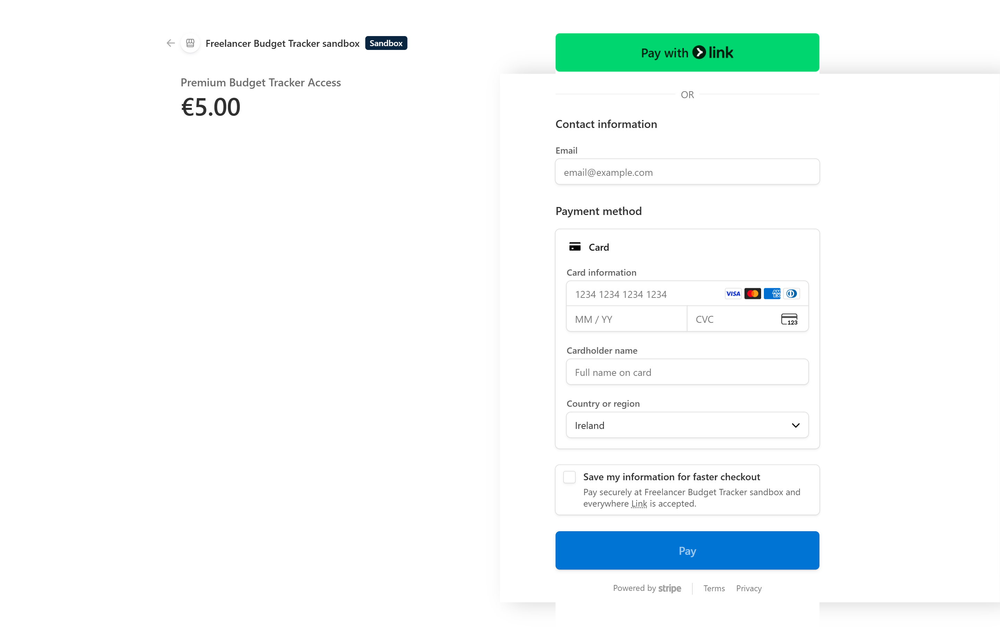

---

## Edge Case Testing

| Scenario | Expected Behaviour | Result |
|---------|------------------|--------|
| No transactions exist | Chart hidden and guidance shown | Pass |
| Empty filters applied | All transactions displayed | Pass |
| Invalid filter combinations | No crashes, safe handling | Pass |
| User accessing another user's data | Access restricted | Pass |

---

## Password Reset Testing

The password reset flow was tested using Django’s console email backend.

| Feature | Expected Behaviour | Result |
|--------|------------------|--------|
| Password reset request | 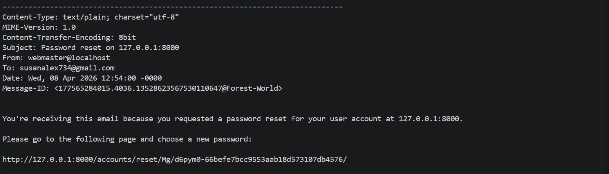 | Pass |

---

## Responsiveness Testing

The application was tested across multiple screen sizes to ensure a responsive and accessible user experience.

| Device | Screen Size | Result |
|-------|------------|--------|
| Desktop | 1920px+ | Fully responsive |
| Laptop | 1366px | Fully responsive |
| Tablet | ~768px | Navigation adapts correctly |
| Mobile | ~375px | Fully responsive |

Improvements include:

- Mobile navigation toggle
- Responsive layout adjustments
- Improved spacing on smaller screens

---

## Browser Compatibility

| Browser | Result |
|--------|--------|
| Google Chrome | Fully functional |
| Microsoft Edge | Fully functional |
| Safari | Fully functional |

---

## Lighthouse Audit

A Lighthouse audit was performed on the deployed application to evaluate performance, accessibility, best practices, and SEO.

The results demonstrate that the application meets modern web standards for performance, accessibility, and usability, with only minor non-critical recommendations identified.

| Page | Screenshot | Result |
|----------|----------|-------------|
| Login |  | Pass |
| Password Reset |  | Pass |
| Password Reset Done |  | Pass |
| Signup |  | Pass |
| Dashboard |  | Pass |
| Categories |  | Pass |
| Add Category |  | Pass |
| Edit Category |  | Pass |
| Transactions |  | Pass |
| Add Transaction |  | Pass |
| Edit Transaction |  | Pass |
| 404 |  | Non-critical 404 warnings during automated scans |
| Logout |  | Pass |
| Premium | 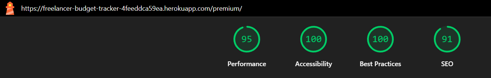 | Pass |
| Home | 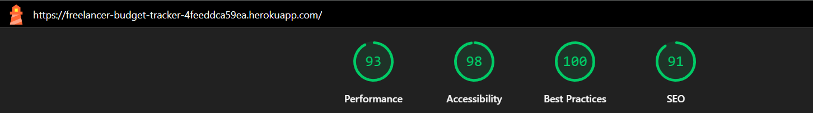 | Pass |
| Payment Successful | 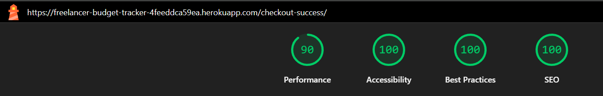 | Pass |

Some Lighthouse recommendations remained non-critical and related to third-party libraries such as Bootstrap, Chart.js, and external CDN resources.

These warnings do not negatively affect functionality, accessibility, or overall user experience and are considered acceptable within the scope of the project.

---

## User Story Testing

Each user story was extensively tested to ensure correct functionality.

| User Story | Action | Expected Outcome | Screenshot | Result |
|------------|--------|-----------------|------------|--------|
| Create account | Submit form | Account created | .png) | Pass |
| Login | Enter credentials | Redirect to dashboard | .png) | Pass |
| Logout | Click logout | Session ends |  | Pass |
| Add category | Submit form | Category saved | .png) | Pass |
| Edit category | Update data | Changes saved |  | Pass |
| Delete category | Confirm delete | Category removed |  | Pass |
| Transaction history | View transactions | Transactions displayed | .png) | Pass |
| Add transaction | Submit form | Transaction saved |  | Pass |
| Edit transaction | Update transaction | Changes saved | .png) | Pass |
| Delete transaction | Confirm delete | Transaction removed |  | Pass |
| Filter transactions | Apply filters | Results updated |  | Pass |
| Dashboard summary | View dashboard | Totals correct |  | Pass |
| Password reset | Request reset | Reset link generated |  | Pass |
| Password reset done | Submit new password | Password updated |  | Pass |
| 404 page | Access invalid route | Custom 404 displayed | .png) | Pass |
| Premium upgrade | Complete payment | Premium access granted | 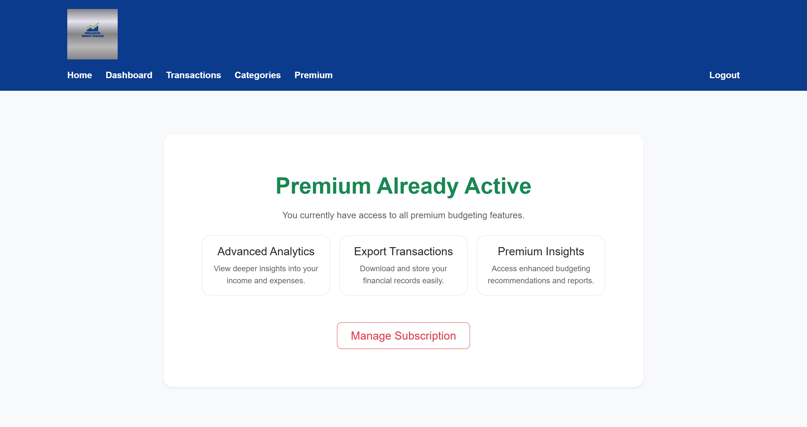 | Pass |
| Payment successful | Complete payment | Confirmation shown | 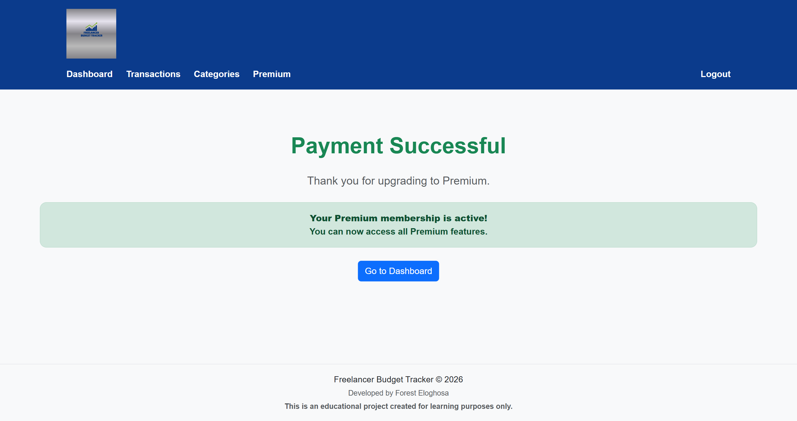 | Pass |
| Home page | Access home | Home page displayed | 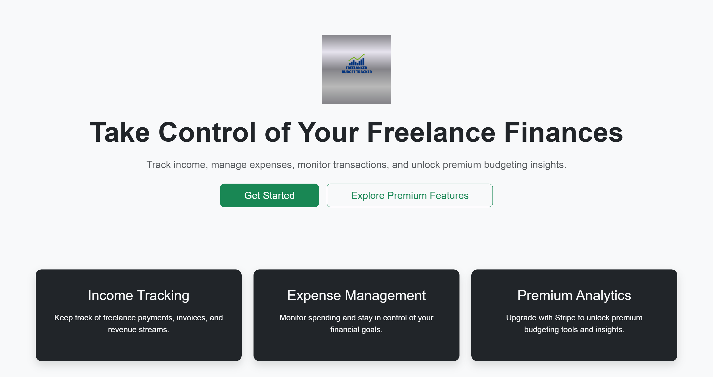 | Pass |

---

## User Feedback & Messaging

Django’s messages framework was implemented to provide users with immediate feedback after actions are performed.

Users receive confirmation messages when:

- Creating an account
- Adding categories
- Editing categories
- Deleting categories
- Adding transactions
- Editing transactions
- Deleting transactions

Messages automatically dismiss after a short delay while still allowing manual dismissal by the user.

---

## Safe Delete Confirmation

Users must confirm before deleting data.

This prevents accidental data loss and improves overall usability.

---

## Accessibility Improvements

Accessibility improvements implemented throughout the project include:

- Form labels for all inputs
- ARIA labels for interactive actions
- Keyboard navigation support
- Improved colour contrast
- Explicit width and height attributes added to images to reduce layout shift
- Meta descriptions added to improve SEO and enhance Lighthouse audit results

---

## Bugs and Fixes

### Deployment Issue

- Problem: Heroku crash due to dependency conflict
- Fix: Removed conflicting package
- Result: Successful deployment

### Mobile Layout Issue

- Problem: Table overflow on smaller screens
- Fix: Responsive layout improvements
- Result: Improved mobile usability

### Navbar Issue

- Problem: Navigation overflow on mobile devices
- Fix: Added responsive navigation toggle
- Result: Improved responsive navigation

### Footer Issue

- Problem: Incorrect footer positioning
- Fix: Flexbox layout implementation
- Result: Stable footer positioning

### Premium Feature 500 Error

- Problem: Premium routes caused a server error after deployment
- Cause: Database migrations for the Profile model had not been applied on Heroku
- Fix: Ran production migrations using the Heroku CLI
- Result: Premium features and dashboard functionality restored successfully

### HTML Validation Error

- Problem: W3C validator reported unclosed div elements on the dashboard page
- Cause: Missing closing div tags within the premium feature section
- Fix: Corrected HTML structure and revalidated all pages
- Result: All tested pages passed validation successfully

---

## Security Testing

- Authentication required for protected routes
- Users can only access their own data
- CSRF protection enabled
- Secure session handling implemented

---

## Performance Observations

The application demonstrates efficient performance with fast load times, responsive interactions, and optimised database queries for the current scale of data.

---

## Final Testing Summary

All features were tested successfully with no critical unresolved issues identified.

The application is stable, responsive, accessible, and meets the requirements for deployment.