# Testing

This section outlines the testing process carried out during the development of the Freelancer Budget Tracker application. Testing was performed to ensure that all features function correctly, the user experience is consistent, and the application meets expected standards.

---

## Code Validation

The application was validated using industry-standard validation tools to ensure clean, accessible, and standards-compliant code.

Return back to the [README.md](README.md) file.

| Page | Screenshot | Result |
|------|------------|--------|
| Login Page | 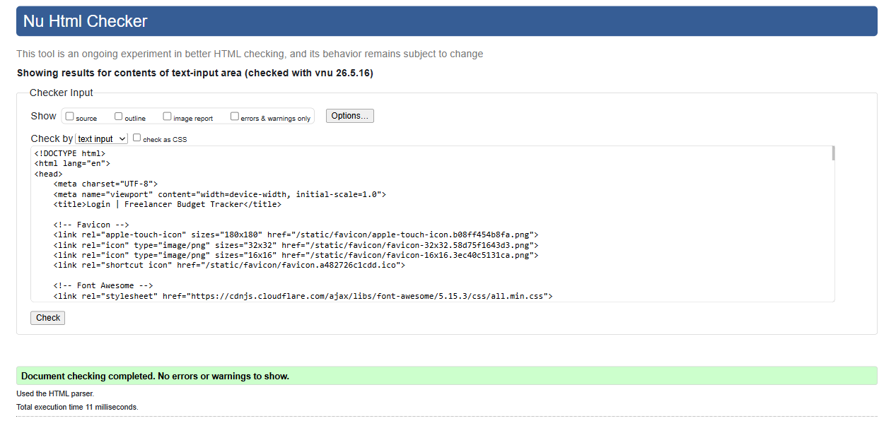 | Pass: No Errors |
| Dashboard | 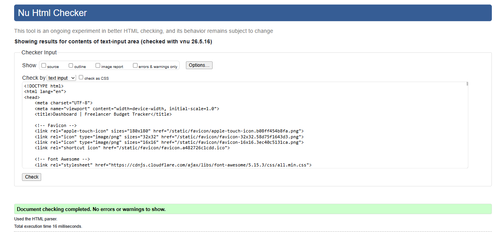 | Pass: No Errors |
| Transactions | 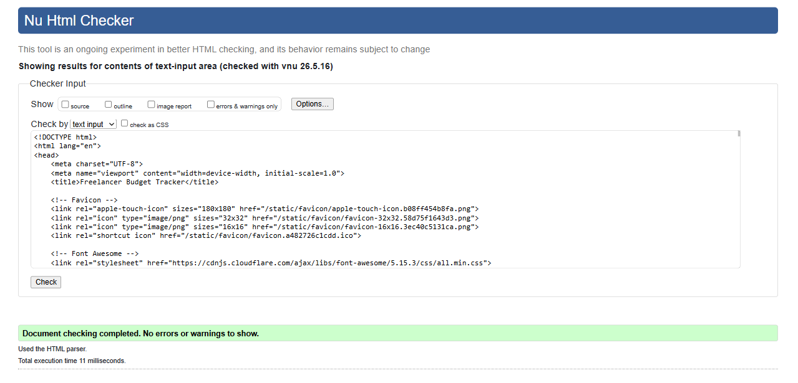 | Pass: No Errors |
| Categories | 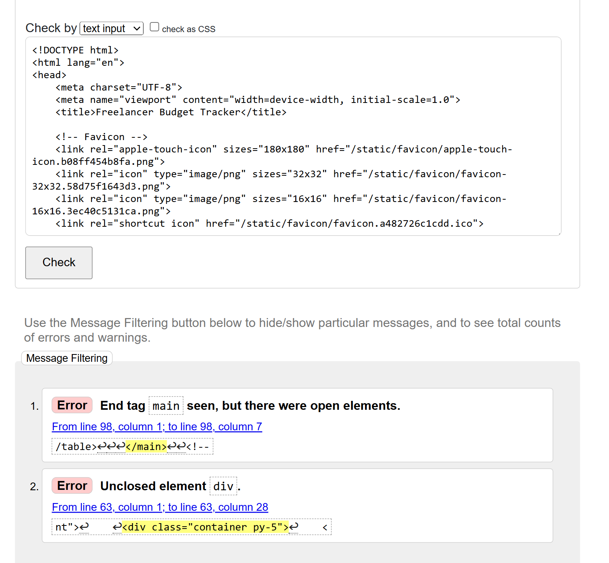 | Minor warning (non-critical) |
| Edit Transaction | 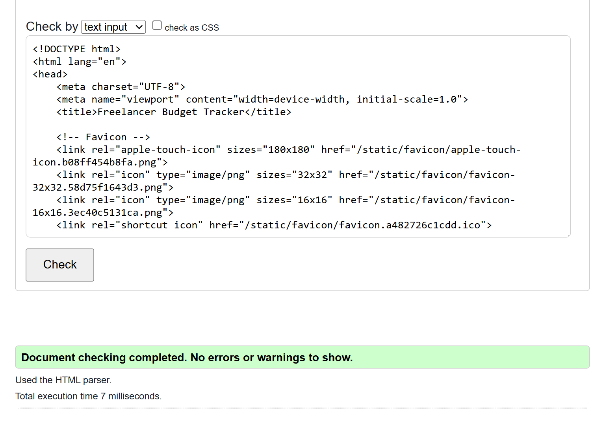 | Pass: No Errors |
| Edit Category | 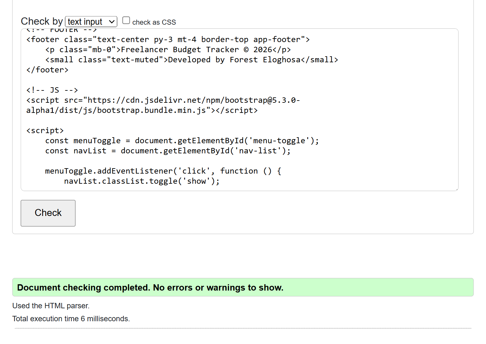 | Pass: No Errors |

The minor validation warning found on the Categories page does not affect application functionality and was determined to be non-critical.

---

### CSS

I have used the recommended [CSS Jigsaw Validator](https://jigsaw.w3.org/css-validator) to validate all of my CSS files.

| File | Jigsaw URL | Screenshot | Result |
| --- | --- | --- | --- |
| style.css | [Jigsaw](https://jigsaw.w3.org/css-validator/validator#warnings) | 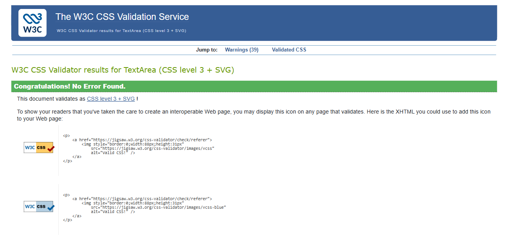 | Pass: No Errors |

---

## Python

I have used the recommended [PEP8 CI Python Linter](https://pep8ci.herokuapp.com/) to validate all of my Python files.

### PEP8 CI Results

All Python files in the project were validated using the PEP8 CI tool, which checks for compliance with the PEP8 style guide. All files passed without any errors, indicating that the code adheres to Python's best practices for readability and maintainability.

| File |  Screenshot | Result |
| --- | --- | --- |
| models.py | 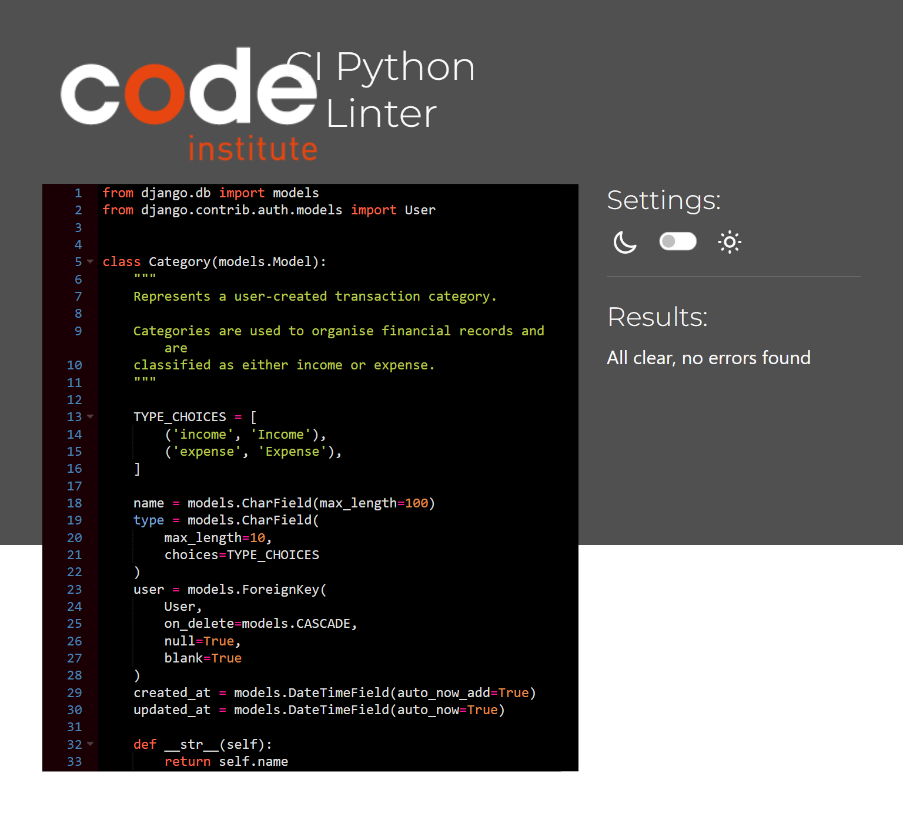 | Pass: No Errors |
| views.py  | 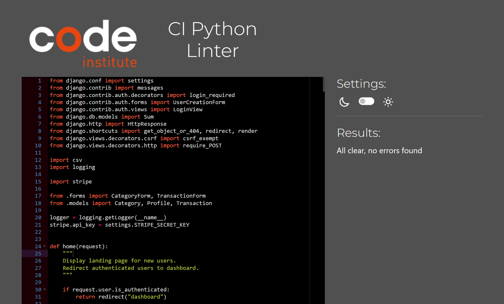 | Pass: No Errors |
| urls.py   | 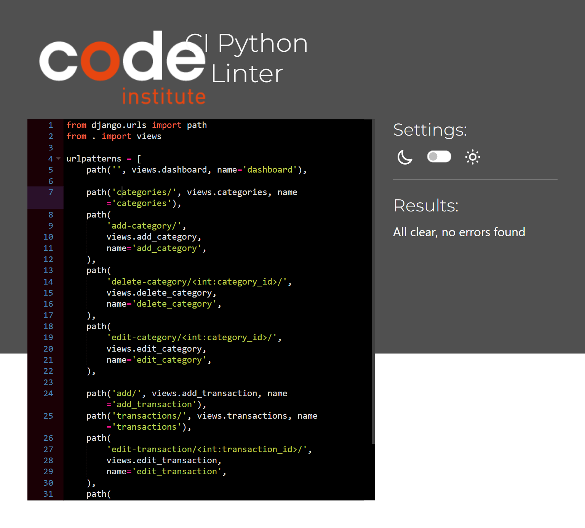 | Pass: No Errors |
| apps.py   | 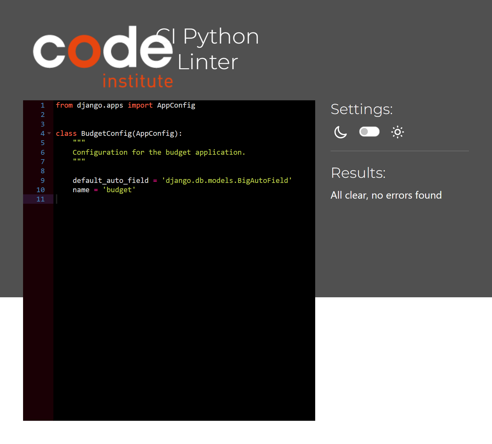 | Pass: No Errors |
| forms.py  | 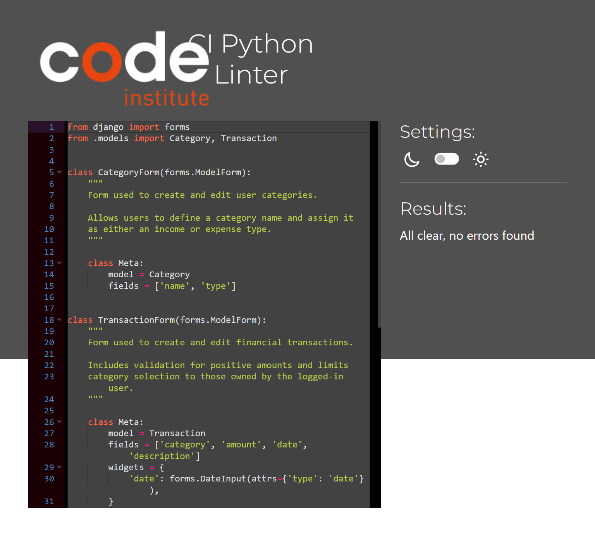 | Pass: No Errors |

---

## Manual Testing

Manual testing was carried out to ensure all core functionality behaves as expected.

| Feature | Expected Behaviour | Testing Performed | Result |
|--------|------------------|------------------|--------|
| User Login | Users can log in with valid credentials | Tested valid and invalid login attempts | Pass |
| User Logout | Users can securely log out | Clicked logout and verified session ended | Pass |
| Create Category | Users can create categories | Added new income and expense categories | Pass |
| Edit Category | Users can update categories | Modified category names and types | Pass |
| Delete Category | Users can delete categories | Deleted categories successfully | Pass |
| Create Transaction | Users can add transactions | Added income and expense entries | Pass |
| Edit Transaction | Users can update transactions | Edited amount and description | Pass |
| Delete Transaction | Users can remove transactions | Deleted entries successfully | Pass |
| Filter by Type | Users should be able to filter by income or expense transactions | Applied type filter and verified only matching transactions were shown | Pass |
| Filter by Category | Users should be able to filter by selected category | Applied category filter and verified only matching transactions were shown | Pass |
| Filter by Month | Users should be able to filter transactions by month | Applied month filter and verified only matching transactions from that month were shown | Pass |
| Combined Filters | Users should be able to combine type, category, and month filters | Applied multiple filters together and verified results matched all selected criteria | Pass |
| Dashboard Summary | Totals update dynamically | Added transactions and verified totals | Pass |

---

### Edge Case Testing 
| Scenario | Expected Behaviour | Result |
|---------|------------------|--------| 
| No transactions exist | Chart should not appear and user should see guidance message | Pass |
|Empty filters applied | System should return all transactions without errors | Pass |
|Invalid filter combinations | System should safely return no results or matching results without crashing | Pass |
|User accesses another user's data | Access should be restricted to the logged-in user only | Pass |
---

### Password Reset Testing

The password reset flow was tested using Django’s console email backend during development. When a password reset request was submitted, the reset email and secure reset link were successfully generated and displayed in the terminal output.

| Feature | Expected Behaviour | Testing Performed | Result |
|--------|------------------|------------------|--------|
| Password Reset Request | User should be able to request a password reset link | Submitted email through password reset form and verified reset link was generated in terminal | Pass |
---
## Responsiveness Testing

The application was tested across multiple screen sizes to ensure a responsive and user-friendly experience.

| Device | Screen Size | Result |
|-------|------------|--------|
| Desktop | 1920px+ | Fully responsive |
| Laptop | 1366px | Fully responsive |
| Tablet | ~768px | Navigation adapts correctly |
| Mobile | ~375px | Mobile menu and layout functional |

Key improvements include:
- Mobile navigation menu toggle
- Card-based transaction layout for small screens
- Responsive tables replaced with mobile-friendly UI

---

## Browser Compatibility

The application was tested across multiple browsers to ensure consistent behaviour.

| Browser | Result |
|--------|--------|
| Google Chrome | Fully functional |
| Microsoft Edge | Fully functional |
| Safari (iPhone) | Fully functional |

---
## Lighthouse Audit

A Lighthouse audit was performed on the deployed application to evaluate performance, accessibility, best practices, and SEO. The results were as follows:
| Page |  Screenshot | Result |
|----------|----------|-------------|
| Login |  |Pass
| Password Reset |  |Pass
| Signup |  |Pass
| Dashboard |  |Pass
| Categories |  |Pass
| Add Category |  |Pass
| Transactions |  |Pass
| Add Transaction |  |Pass
| 404 | .png) |Pass
| Logout |  |Pass

---
## User Story Testing
All user stories were tested successfully, with the application behaving as expected for each scenario. Users can log in, manage categories and transactions, filter their financial data, and view summaries without any issues. Each feature was verified to meet the requirements outlined in the user stories, ensuring a positive user experience and functional application.

| User Story | Screenshot | Result |
|------------|------------------|--------|
| User Login | .png) | Testing completed with no errors |
| User Signup | .png) | Pass |
| User Logout | .png) | Pass |
| Categories | .png) | Pass |
| Add Category | .png) | Pass |
| Delete Category | 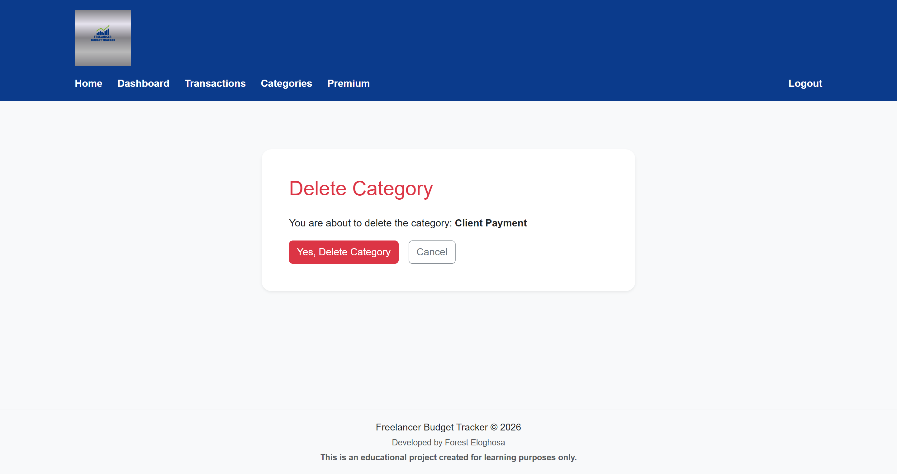 | Pass |
| Transactions | .png) | Pass |
| Add Transaction | 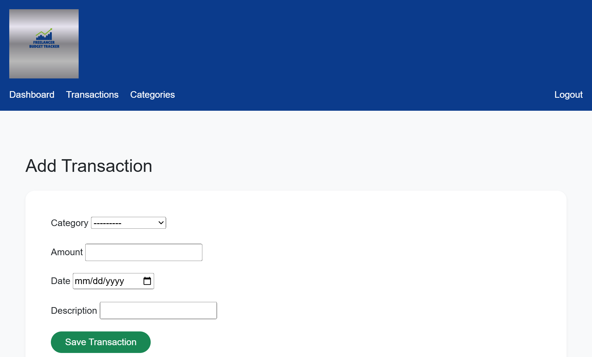 | Pass |
| Delete Transaction | 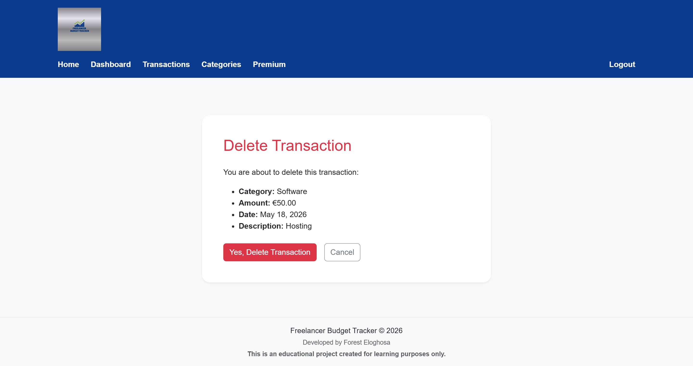 | Pass | 
| Filter by type [Income], category, and month | 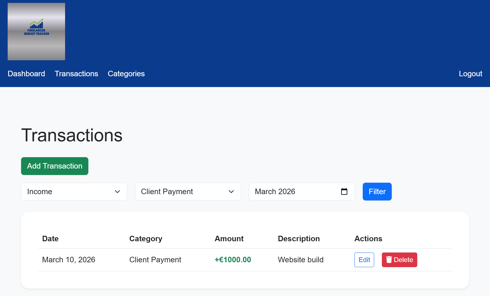 | Pass |
| Filter by type [Expense], category, and month | 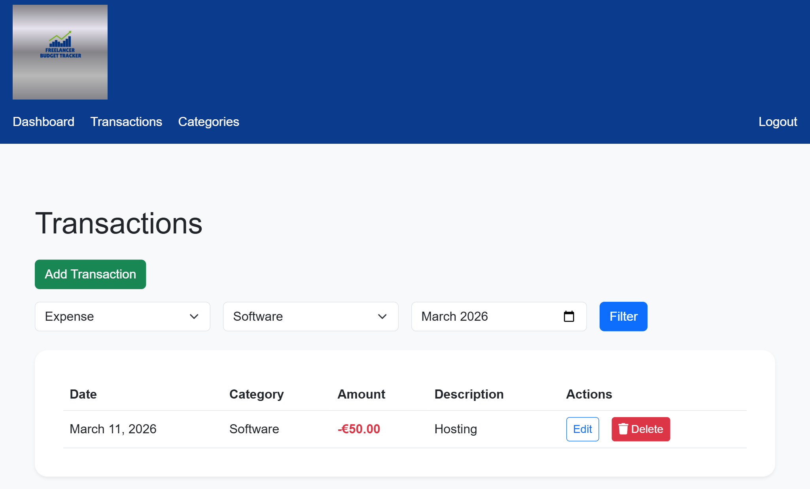 | Pass |
| Dashboard | 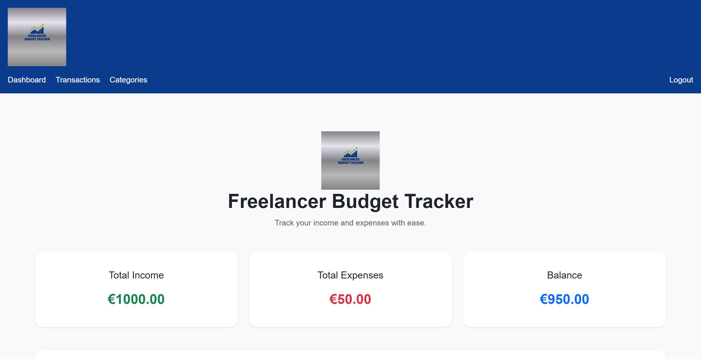 | Pass |
| Password Reset | 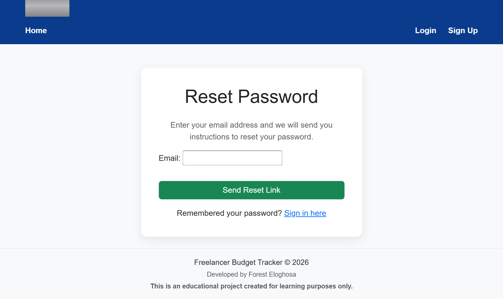 | Pass |
| Password Reset Done | 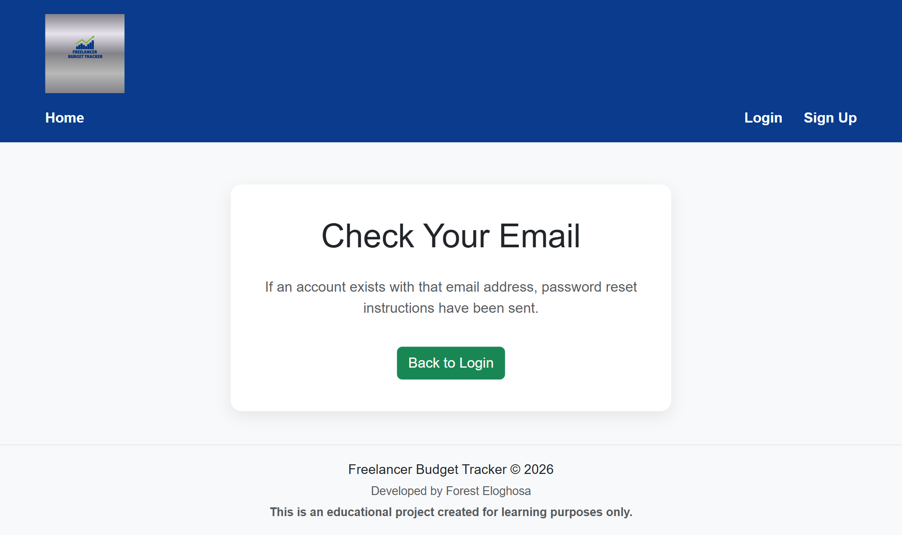 | Pass |
| 404 Page | .png) | Pass |

---
## Bugs and Fixes

### Issue 1 – Heroku Deployment Crash

- **Problem:** Application failed to start due to missing dependency (`pkg_resources`)
- **Solution:** Removed conflicting dependency from requirements.txt
- **Result:** Application deployed successfully

---

### Issue 2 – Mobile Table Overflow

- **Problem:** Transaction table overflowed on small screens
- **Solution:** Replaced table with mobile-friendly card layout
- **Result:** Improved usability on mobile devices

---

### Issue 3 – Navbar Responsiveness

- **Problem:** Navigation links overflowed on mobile
- **Solution:** Implemented hamburger menu toggle
- **Result:** Clean and accessible mobile navigation

---

### Issue 4 – Footer Positioning

- **Problem:** Footer floated inconsistently on pages with little content
- **Solution:** Applied flexbox layout with `min-height: 100vh`
- **Result:** Footer remains correctly positioned at the bottom

---

## Security Testing

The application includes basic security measures:

- User authentication required for all protected pages
- Users can only access their own data
- CSRF protection enabled via Django forms
- Sensitive routes protected using Django authentication system

---

## Performance Observations

- Pages load quickly under normal usage
- Database queries are efficient for current data scale
- No noticeable lag during transaction filtering or CRUD operations

---

## Final Testing Summary

All core features of the Freelancer Budget Tracker application were tested successfully. The system behaves as expected across different devices and browsers, with no critical issues affecting usability or functionality.

The application is considered stable, responsive, and ready for deployment.
