# Testing

This section outlines the testing process carried out during the development of the Freelancer Budget Tracker application. Testing was performed to ensure that all features function correctly, the user experience is consistent, and the application meets expected standards.

---

## Code Validation

The application was validated using industry-standard tools to ensure clean, accessible, and standards-compliant code.

Return back to the [README.md](README.md) file.

| Page | Screenshot | Result |
|------|------------|--------|
| Login Page |  | Pass: No Errors |
| Dashboard |  | Pass: No Errors |
| Transactions |  | Pass: No Errors |
| Categories |  | Minor warning (non-critical) |
| Edit Transaction |  | Pass: No Errors |
| Edit Category |  | Pass: No Errors |

The minor validation warning found on the Categories page does not affect application functionality and was determined to be non-critical.

---

### CSS Validation

The CSS was validated using the [W3C Jigsaw Validator](https://jigsaw.w3.org/css-validator).

| File | Screenshot | Result |
|------|------------|--------|
| style.css |  | Pass: No Errors |

---

## Python Validation

Python code was validated using the [PEP8 CI Python Linter](https://pep8ci.herokuapp.com/).

All files passed without errors, confirming adherence to Python best practices.

| File | Screenshot | Result |
|------|------------|--------|
| models.py |  | Pass |
| views.py |  | Pass |
| urls.py |  | Pass |
| forms.py |  | Pass |

---

## Manual Testing

Manual testing was conducted to verify all core functionality.

| Feature | Expected Behaviour | Testing Performed | Result |
|--------|------------------|------------------|--------|
| User Login | Users can log in with valid credentials | Tested valid and invalid login attempts | Pass |
| User Logout | Users can securely log out | Clicked logout and verified session ended | Pass |
| Create Category | Users can create categories | Added income and expense categories | Pass |
| Edit Category | Users can update categories | Modified category details | Pass |
| Delete Category | Users can delete categories | Deleted categories successfully | Pass |
| Create Transaction | Users can add transactions | Added income and expense entries | Pass |
| Edit Transaction | Users can update transactions | Edited amount and description | Pass |
| Delete Transaction | Users can remove transactions | Deleted entries successfully | Pass |
| Filter by Type | Filter income or expense | Applied filter and verified results | Pass |
| Filter by Category | Filter by category | Applied category filter | Pass |
| Filter by Month | Filter by month | Applied month filter | Pass |
| Combined Filters | Combine multiple filters | Verified correct filtered results | Pass |
| Dashboard Summary | Totals update dynamically | Verified calculations update correctly | Pass |

---

## Edge Case Testing

| Scenario | Expected Behaviour | Result |
|---------|------------------|--------|
| No transactions exist | Chart hidden and guidance shown | Pass |
| Empty filters applied | All transactions displayed | Pass |
| Invalid filter combinations | No crashes, safe handling | Pass |
| User accessing another user's data | Access restricted | Pass |

---

## Password Reset Testing

The password reset flow was tested using Django’s console email backend.

| Feature | Expected Behaviour | Result |
|--------|------------------|--------|
| Password reset request | Reset link generated | Pass |

---

## Responsiveness Testing

The application was tested across multiple screen sizes.

| Device | Screen Size | Result |
|-------|------------|--------|
| Desktop | 1920px+ | Fully responsive |
| Laptop | 1366px | Fully responsive |
| Tablet | ~768px | Navigation adapts correctly |
| Mobile | ~375px | Fully responsive |

Improvements include:

- Mobile navigation toggle
- Responsive layout adjustments
- Improved small screen spacing

---

## Browser Compatibility

| Browser | Result |
|--------|--------|
| Google Chrome | Fully functional |
| Microsoft Edge | Fully functional |
| Safari | Fully functional |

---
## Lighthouse Audit

A Lighthouse audit was performed on the deployed application to evaluate performance, accessibility, best practices, and SEO. The results were as follows:

The results demonstrate that the application meets modern web standards for performance, accessibility, and usability, with only minor non-critical recommendations identified.

| Page |  Screenshot | Result |
|----------|----------|-------------|
| Login | 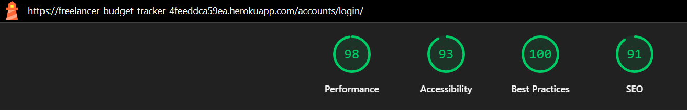 |Pass |
| Password Reset | 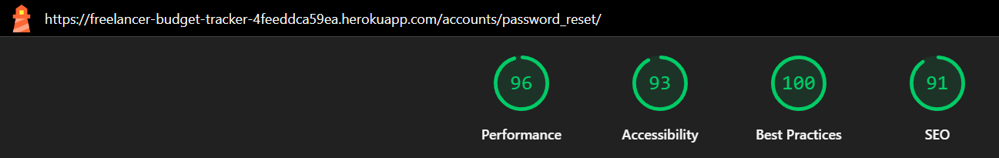 |Pass |
| Password Reset Done | 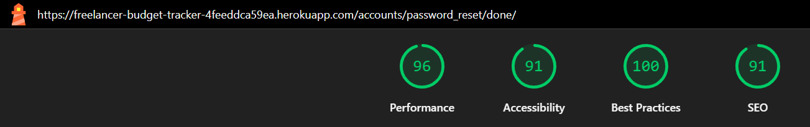 |Pass |
| Signup | 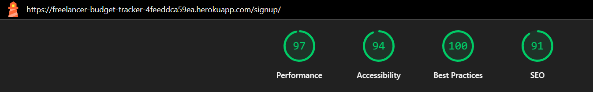 |Pass |
| Dashboard | 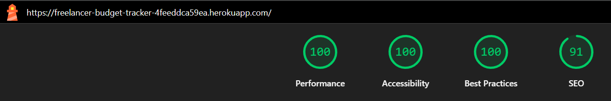 |Pass |
| Categories | 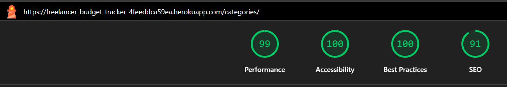 |Pass |
| Add Category | 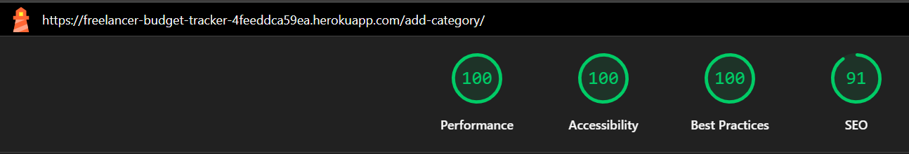 |Pass |
| Edit Category | 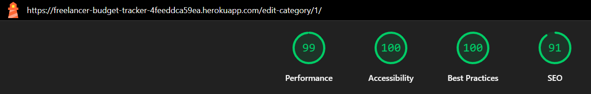 |Pass |
| Transactions | 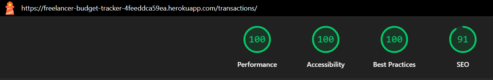 |Pass |
| Add Transaction | 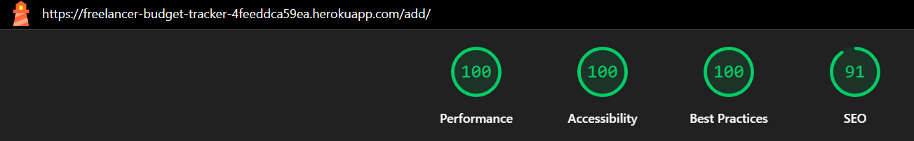 |Pass |
| Edit Transaction | 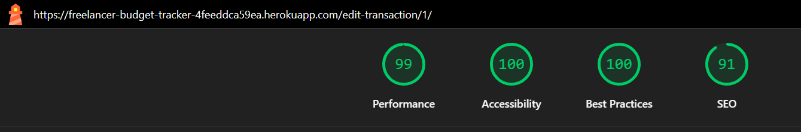 |Pass |
| 404 | 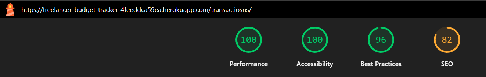 |Non-critical 404 warnings during automated scans
| Logout | 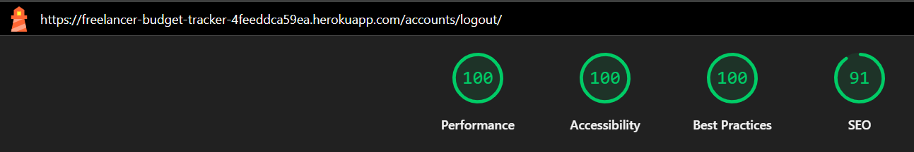 |Pass |

---
## User Story Testing

Each user story was tested to ensure correct functionality.

| User Story | Action | Expected Outcome | Screenshot | Result |
|------------|--------|-----------------|------------|--------|
| Create account | Submit form | Account created | .png) | Pass |
| Login | Enter credentials | Redirect to dashboard | .png) | Pass |
| Logout | Click logout | Session ends | 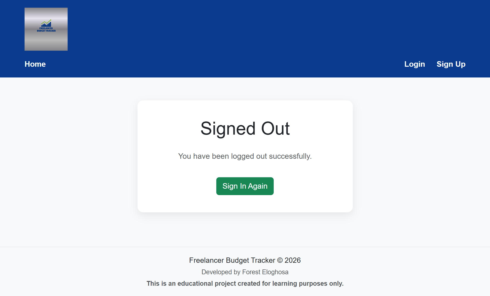 | Pass |
| Add category | Submit form | Category saved | .png) | Pass |
| Edit category | Update data | Changes saved | 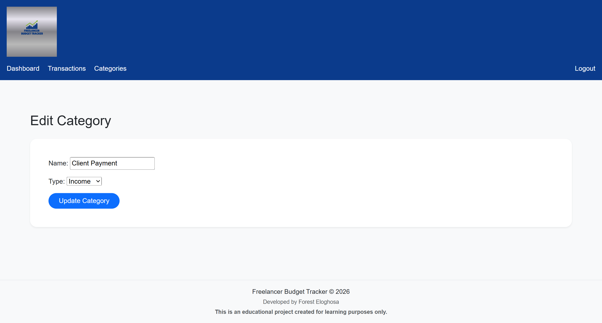 | Pass |
| Delete category | Confirm delete | Category removed |  | Pass |
| Transaction history | View transactions | Transactions displayed | .png) | Pass |
| Add transaction | Submit form | Transaction saved |  | Pass |
| Edit transaction | Update transaction | Changes saved | .png) | Pass |
| Delete transaction | Confirm delete | Transaction removed |  | Pass |
| Filter transactions | Apply filters | Results updated |  | Pass |
| Dashboard summary | View dashboard | Totals correct |  | Pass |
| Password reset | Request reset | Reset link generated |  | Pass |
| Password reset done | Submit new password | Password updated |  | Pass |
| 404 page | Access invalid route | Custom 404 displayed | .png) | Pass |

---

## User Feedback & Messaging

Django messages framework was implemented to provide feedback on user actions.

Users receive confirmation when:

- Creating an account
- Adding/editing/deleting categories
- Adding/editing/deleting transactions

Messages automatically dismiss after a short delay while still allowing manual dismissal by the user.
---

## Safe Delete Confirmation

Users must confirm before deleting data.

This prevents accidental loss and improves usability.

---

## Accessibility Improvements

Improvements include:

- Form labels for all inputs
- ARIA labels for actions
- Keyboard navigation support
- Improved contrast

---

## Bugs and Fixes

### Deployment Issue

- Problem: Heroku crash due to dependency conflict  
- Fix: Removed conflicting package  
- Result: Successful deployment  

### Mobile Layout Issue

- Problem: Table overflow  
- Fix: Responsive design improvements  
- Result: Improved usability  

### Navbar Issue

- Problem: Overflow on mobile  
- Fix: Added toggle menu  
- Result: Responsive navigation  

### Footer Issue

- Problem: Incorrect positioning  
- Fix: Flexbox layout  
- Result: Stable footer  

---

## Security Testing

- Authentication required for protected routes  
- Users can only access their own data  
- CSRF protection enabled  
- Secure session handling  

---

## Performance Observations

 The application demonstrates efficient performance with fast load times, responsive interactions, and optimised database queries for the current scale of data.
  

---

## Final Testing Summary

All features were tested successfully.

The application is stable, responsive, and ready for deployment.