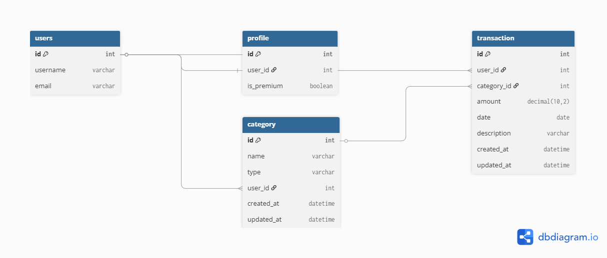

# Freelancer Budget Tracker - ERD

This document outlines the Entity-Relationship Diagram (ERD) for the Freelancer Budget Tracker application. The ERD illustrates the relationships between different entities in the system, which are essential for managing budgets, expenses, and income.

```
Table users {
  id int [pk]
  username varchar
  email varchar
}

Table category {
  id int [pk]
  name varchar
  type varchar  // Income or Expense
  user_id int [ref: > users.id]
  created_at datetime
  updated_at datetime
}

Table transaction {
  id int [pk]
  user_id int [ref: > users.id]
  category_id int [ref: > category.id]
  amount decimal(10,2)
  date date
  description varchar
  created_at datetime
  updated_at datetime
}
```
In this ERD:
- The `users` table represents Django’s built-in authentication model,
which manages registered users of the application.

- The `category` table categorizes transactions as either income or
expense types and links them to a specific user. This ensures that
each user manages their own financial categories independently.

- The `transaction` table records  individual transactions, linking them to both the user and the category they belong to. Each transaction includes details such as the amount, date, and description.

This structure allows for efficient tracking and management of budgets, enabling users to categorize their income and expenses effectively.


## Entity Relationship Diagram (ERD)

The ERD below illustrates the database structure of the Freelancer
Budget Tracker application. It defines the relationships between
Users, Categories, and Transactions to ensure proper data ownership
and organization.



# Relationship Summary:
Relationships between entities in the Freelancer Budget Tracker application are as follows:
- A User can create many Categories.
- A User can create many Transactions.
- A Category can contain many Transactions.
- Each Transaction belongs to exactly one User and one Category.

